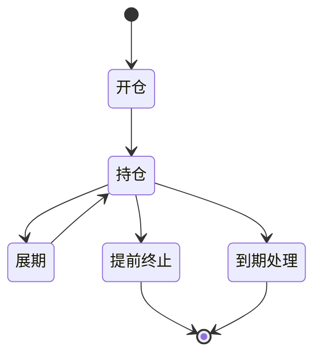

# {资产名称} 业务探查文档

## 1. 业务定义与品种分类

### 产品定义
【依据：《XX规则》第X条】

### 品种分类体系
| 分类维度 | 类型A | 类型B | 说明 |
|---------|------|------|-----|
| ... | ... | ... | ... |

### 交易对象类型范围
【依据：《XX规则》第X条】

---

## 2. 参与主体与准入条件

### 交易参与人资格
【依据：《XX规则》第X条】

| 参与主体类型 | 准入条件 | 权限 | 限制 |
|------------|--------|-----|-----|
| ... | ... | ... | ... |

---

## 3. 账户体系

| 账户类型 | 用途 | 权限 | 冻结规则 |
|---------|-----|-----|---------|
| ... | ... | ... | ... |

---

## 4. 交易流程


| 环节 | 参与方 | 时间要求 | 失败处理 |
|-----|-------|--------|---------|
| ... | ... | ... | ... |

---

## 5. 合约生命周期与状态机



| 阶段 | 规则 | 条件 |
|-----|-----|-----|
| 开仓 | ... | ... |
| 持仓 | ... | ... |
| 展期 | ... | ... |

---

## 6. 清结算机制

| 清结算要素 | 规则 | 计算公式 |
|----------|-----|---------|
| 清算模式 | ... | ... |
| 结算方式 | ... | ... |
| 担保品管理 | ... | ... |
| 保证金制度 | ... | ... |

---

## 7. 关键字段矩阵

| 字段名 | 指令字段 | 合约字段 | 结算字段 | 可修改性 | 数据类型 |
|-------|--------|--------|--------|--------|--------|
| ... | ... | ... | ... | ... | ... |

---

## 8. 与其他品种的差异对比表

| 维度 | 本品种 | 品种A | 品种B | 备注 |
|-----|------|------|------|-----|
| 清算方式 | ... | ... | ... | |
| 保证金模式 | ... | ... | ... | |
| 交割方式 | ... | ... | ... | |

---

## 9. 待核实事项清单

- 【待核实】：...
- 【原文冲突】：...
- 【表述模糊】：...
- 【缺失信息】：...

---

## 10. Gap 清单（YAML）

```yaml
gaps:
  - id: GAP-001
    section: ""
    question: ""
    priority: P0
    recon_keywords: []
    source_refs: []
```

---

## 📚 参考资料

1. [文件名](URL)
2. [文件名](URL)
