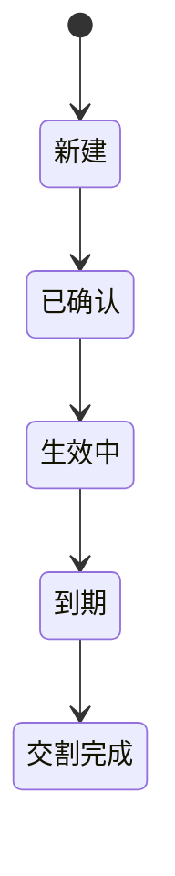

# {资产名称} 业务探查文档

## 1. 业务定义与品种分类

### 产品定义
【依据：《XX规则》第X条】

### 品种分类体系
| 分类维度 | 类型A | 类型B | 说明 |
|---------|------|------|-----|
| ... | ... | ... | ... |

### 交易对象类型范围
【依据：《XX规则》第X条】

---

## 2. 参与主体与准入条件

### 交易参与人资格
【依据：《XX规则》第X条】

| 参与主体类型 | 准入条件 | 权限 | 限制 |
|------------|--------|-----|-----|
| ... | ... | ... | ... |

---

## 3. 账户体系

| 账户类型 | 用途 | 权限 | 冻结规则 |
|---------|-----|-----|---------|
| ... | ... | ... | ... |

---

## 4. 交易流程

> 🚨 必须绘制该品种专属 Mermaid 流程图，不得使用通用模板替代。


| 环节 | 参与方 | 时间要求 | 失败处理 |
|-----|-------|--------|---------|
| ... | ... | ... | ... |

---

## 5. 合约生命周期与状态机

> 🚨 必须绘制该品种专属 Mermaid 状态图，不得使用通用模板替代。



| 阶段 | 规则 | 条件 | 依据 |
|-----|-----|-----|------|
| 开仓 | ... | ... | ... |
| 持仓 | ... | ... | ... |
| 展期 | ... | ... | ... |
| 到期 | ... | ... | ... |
| 违约 | ... | ... | ... |

---

## 6. 清结算机制

| 清结算要素 | 规则 | 计算公式 |
|----------|-----|---------|
| 清算模式 | ... | ... |
| 结算方式 | ... | ... |
| 担保品管理 | ... | ... |
| 保证金制度 | ... | ... |

---

## 7. 关键字段矩阵

| 字段名 | 指令字段 | 合约字段 | 结算字段 | 可修改性 | 数据类型 |
|-------|--------|--------|--------|--------|--------|
| ... | ... | ... | ... | ... | ... |

---

## 8. 与其他品种的差异对比表

| 维度 | 本品种 | 品种A | 品种B | 备注 |
|-----|------|------|------|-----|
| 清算方式 | ... | ... | ... | |
| 保证金模式 | ... | ... | ... | |
| 交割方式 | ... | ... | ... | |

---

## 9. 待核实事项清单

- 【待核实】：...
- 【原文冲突】：...
- 【表述模糊】：...
- 【缺失信息】：...

---

## 10. Gap 清单（YAML）

```yaml
gaps:
  - id: GAP-001
    section: ""
    question: ""
    priority: P0
    recon_keywords: []
    source_refs: []
```

---

## 📚 参考资料

1. [文件名](URL)
2. [文件名](URL)

---

# ============================================================
# 多品种综合探查模式 — 额外章节模板
# 当探查品种 > 2 时，在末尾追加以下综合合成章节
# ============================================================

## 综合合成

### S.1 品种分类总表（§B.1 聚合）

| 品种代码 | 品种名称 | 交易场所 | 产品大类 | 交割类型 | 保证金要求 |
|---------|---------|---------|---------|---------|-----------|
| ... | ... | ... | ... | ... | ... |

【依据：汇总各品种对应的官方定义条款】

---

### S.2 参与主体矩阵（§B.2 跨品种汇总）

| 参与主体类型 | 外汇即期 | 外汇远期 | 外汇掉期 | ... | 准入条件 | 权限 | 限制 |
|------------|---------|---------|---------|-----|---------|-----|-----|
| 境内银行 | ✓ | ✓ | ✓ | ... | ... | ... | ... |
| 境外金融机构 | ✓ | ✓ | ✓ | ... | ... | ... | ... |
| 非银行金融机构 | ... | ... | ... | ... | ... | ... | ... |
| 企业客户 | ... | ... | ... | ... | ... | ... | ... |
| 个人 | ... | ... | ... | ... | ... | ... | ... |

【依据：《银行间外汇市场管理规定》第十条、第十一条、第三十三条】

---

### S.3 账户体系对照表（§B.3 跨品种汇总）

| 账户类型 | 适用品种 | 用途 | 权限 | 冻结规则 |
|---------|---------|-----|-----|---------|
| ... | ... | ... | ... | ... |

---

### S.4 交易流程差异对比表（§B.4 聚合）

> ⚠️ 这里只做对比，各品种独立流程图已在对应章节给出。

| 环节 | 即期 | 远期 | 掉期 | NDF | 货币掉期 | 期权 | 存单 | 回购 | 拆借 | 期货 | TRS | 结售汇 | 买卖 |
|-----|------|------|-----|-----|---------|-----|-----|-----|-----|-----|-----|-------|-----|
| 询价/报价 | ✓ | ✓ | ✓ | ✓ | ✓ | ✓ | — | ✓ | ✓ | ✓ | ✓ | — | ✓ |
| 撮合/协商 | ✓ | ✓ | ✓ | ✓ | ✓ | ✓ | — | ✓ | ✓ | ✓ | ✓ | — | ✓ |
| 实需审核 | — | — | — | — | — | — | — | — | — | — | — | ✓ | — |
| 确认/成交 | ✓ | ✓ | ✓ | ✓ | ✓ | ✓ | ✓ | ✓ | ✓ | ✓ | ✓ | ✓ | ✓ |
| 期权费支付 | — | — | — | — | — | ✓ | — | — | — | — | — | — | — |
| 抵押品管理 | — | — | — | — | — | — | — | ✓ | — | — | — | — | — |
| 定盘汇率获取 | — | — | — | ✓ | — | ✓(差额) | — | — | — | — | — | — | — |
| 行权/放弃决策 | — | — | — | — | — | ✓ | — | — | — | — | — | — | — |
| 差额计算 | — | ✓(差额) | — | ✓ | — | ✓(差额) | — | — | — | — | ✓ | — | — |
| 清算 | ✓ | ✓ | ✓ | ✓ | ✓ | ✓ | ✓ | ✓ | ✓ | ✓ | ✓ | ✓ | ✓ |
| 结算/交割 | ✓ | ✓ | ✓ | ✓ | ✓ | ✓ | ✓ | ✓ | ✓ | ✓ | ✓ | ✓ | ✓ |

---

### S.5 生命周期状态机差异对比表（§B.5 聚合）

> ⚠️ 这里只做对比，各品种独立状态图已在对应章节给出。

| 状态 | 即期 | 远期 | 掉期 | NDF | 货币掉期 | 期权 | 存单 | 回购 | 拆借 | 期货 | TRS | 结售汇 | 买卖 |
|-----|------|------|-----|-----|---------|-----|-----|-----|-----|-----|-----|-------|-----|
| NEW(新建) | ✓ | ✓ | ✓ | ✓ | ✓ | ✓ | ✓ | ✓ | ✓ | ✓ | ✓ | ✓ | ✓ |
| CONFIRMED(已确认) | ✓ | ✓ | ✓ | ✓ | ✓ | ✓ | ✓ | ✓ | ✓ | ✓ | ✓ | ✓ | ✓ |
| ACTIVE/HOLDING(生效中) | — | ✓ | ✓ | ✓ | ✓ | ✓ | ✓ | ✓ | ✓ | ✓ | ✓ | ✓ | — |
| FIXING(定盘) | — | — | — | ✓ | — | ✓(差额) | — | — | — | — | — | — | — |
| EXERCISED(行权) | — | — | — | — | — | ✓ | — | — | — | — | — | — | — |
| COLLATERAL_PLEDGED(质押) | — | — | — | — | — | — | — | ✓ | — | — | — | — | — |
| ROLLOVER(展期) | — | ✓ | ✓ | ✓ | ✓ | — | — | — | ✓ | — | — | ✓ | — |
| EARLY_TERM(提前终止) | — | ✓ | ✓ | ✓ | ✓ | — | ✓ | ✓ | ✓ | — | ✓ | ✓ | — |
| MATURITY(到期) | — | ✓ | ✓ | ✓ | ✓ | ✓ | ✓ | ✓ | ✓ | ✓ | ✓ | ✓ | — |
| SETTLING(交割中) | ✓ | ✓ | ✓ | ✓ | ✓ | ✓ | — | ✓ | ✓ | — | ✓ | ✓ | ✓ |
| SETTLED(完成) | ✓ | ✓ | ✓ | ✓ | ✓ | ✓ | ✓ | ✓ | ✓ | ✓ | ✓ | ✓ | ✓ |
| DEFAULTED(违约) | ✓ | ✓ | ✓ | ✓ | ✓ | ✓ | — | ✓ | ✓ | — | ✓ | — | — |

> 每品种特有状态说明见对应品种章节的状态图。

---

### S.6 清结算机制对比（§B.6 跨品种汇总）

| 品种 | 清算模式 | 结算方式 | 担保品 | 保证金 | 盯市频率 | 违约处理 |
|------|---------|---------|--------|-------|---------|---------|
| 外汇即期 | 双边/集中 | 全额交割 | 无 | 否 | — | ... |
| 外汇远期 | 双边/净额 | 实物/差额 | — | 是 | ... | ... |
| ... | ... | ... | ... | ... | ... | ... |

---

### S.7 关键字段矩阵（§B.7 品种×字段二维矩阵）

| 字段名 | 即期 | 远期 | 掉期 | NDF | 货币掉期 | 期权 | 回购 | 拆借 | 期货 | TRS | 结售汇 | 买卖 | 数据类型 |
|-------|------|------|-----|-----|---------|-----|-----|-----|-----|-----|-------|-----|---------|
| 交易编号 | ✓ | ✓ | ✓ | ✓ | ✓ | ✓ | ✓ | ✓ | ✓ | ✓ | ✓ | ✓ | String |
| 交易日期 | ✓ | ✓ | ✓ | ✓ | ✓ | ✓ | ✓ | ✓ | ✓ | ✓ | ✓ | ✓ | Date |
| 起息日 | ✓ | ✓ | ✓ | ✓ | ✓ | ✓ | ✓ | ✓ | — | ✓ | ✓ | ✓ | Date |
| 到期日 | — | ✓ | ✓ | ✓ | ✓ | ✓ | ✓ | ✓ | ✓ | ✓ | ✓ | — | Date |
| 名义本金 | — | ✓ | ✓ | ✓ | ✓ | ✓ | ✓ | ✓ | ✓ | ✓ | ✓ | — | Decimal |
| 货币对 | ✓ | ✓ | ✓ | ✓ | ✓ | ✓ | ✓ | ✓ | ✓ | — | ✓ | ✓ | String |
| 汇率/价格 | ✓ | ✓ | ✓ | ✓ | ✓ | ✓(执行价) | ✓(回购利率) | ✓(拆借利率) | ✓ | — | ✓ | ✓ | Decimal |
| 保证金 | — | ✓ | ✓ | ✓ | ✓ | ✓ | ✓(抵押品) | — | ✓ | ✓ | — | — | Decimal |
| ... | ... | ... | ... | ... | ... | ... | ... | ... | ... | ... | ... | ... | |

---

### S.8 品种差异对比表（§B.8）

| 维度 | 即期 | 远期 | 掉期 | NDF | 货币掉期 | 期权 | 存单 | 回购 | 拆借 | 期货 | TRS | 结售汇 | 买卖 |
|-----|------|------|-----|-----|---------|-----|-----|-----|-----|-----|-----|-------|-----|
| 清算方式 | ... | ... | ... | ... | ... | ... | ... | ... | ... | ... | ... | ... | ... |
| 保证金模式 | ... | ... | ... | ... | ... | ... | ... | ... | ... | ... | ... | ... | ... |
| 交割方式 | ... | ... | ... | ... | ... | ... | ... | ... | ... | ... | ... | ... | ... |
| 交易场所 | ... | ... | ... | ... | ... | ... | ... | ... | ... | ... | ... | ... | ... |
| ... | ... | ... | ... | ... | ... | ... | ... | ... | ... | ... | ... | ... | ... |

---

### S.9 待核实事项清单（§B.9 汇总）

- 【原文冲突】：...
- 【表述模糊】：...
- 【缺失信息】：...
- 【版本问题】：...

### S.10 Gap 清单（YAML — 强制）

```yaml
gaps:
  - id: GAP-001
    section: ""
    question: ""
    priority: P0
    recon_keywords: []
    source_refs: []
  - id: GAP-002
    section: ""
    question: ""
    priority: P1
    recon_keywords: []
    source_refs: []
```
